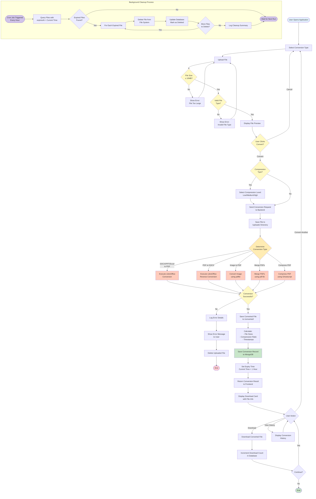

# Activity Diagram - Conversion Workflow

## Activity Flow Description

### Main Conversion Workflow

#### 1. Initialization Phase
- **Start**: User opens the UniConvert application
- **Select Conversion Type**: User chooses from available conversion options:
  - DOCX to PDF
  - PDF to DOCX
  - PPT to PDF
  - Excel to PDF
  - Image to PDF
  - Merge PDFs
  - Compress PDF

#### 2. File Upload Phase
- **Upload File**: User uploads file via drag-and-drop or file browser
- **Validate Size**: System checks if file size ≤ 10MB
  - If **No**: Show error message, return to upload
  - If **Yes**: Proceed to type validation
- **Validate Type**: System checks if file type matches conversion type
  - If **No**: Show error message, return to upload
  - If **Yes**: Show file preview

#### 3. Confirmation Phase
- **Show Preview**: Display file name, size, and type
- **User Confirms**: User decides to convert or cancel
  - If **Cancel**: Return to conversion type selection
  - If **Convert**: Proceed to conversion

#### 4. Compression Selection (Conditional)
- **Check Compression**: If conversion type is "Compress PDF"
  - **Yes**: User selects compression level (Low/Medium/High)
  - **No**: Skip to send request

#### 5. Backend Processing Phase
- **Send Request**: Frontend sends conversion request to backend
- **Save Upload**: Backend saves file to `/uploads/` directory
- **Determine Type**: System routes to appropriate conversion method

#### 6. Conversion Execution
Based on conversion type, execute one of:
- **LibreOffice Convert**: For DOCX/PPT/Excel → PDF
- **LibreOffice Reverse**: For PDF → DOCX
- **Image Convert**: For JPG/PNG → PDF (using pdfkit)
- **Merge PDF**: For combining multiple PDFs (using pdf-lib)
- **Compress PDF**: For reducing PDF size (using Ghostscript)

#### 7. Result Handling
- **Check Success**: Verify conversion completed successfully
  - If **No**: 
    - Log error details
    - Show error message to user
    - Delete uploaded file
    - End process
  - If **Yes**: Continue to save result

#### 8. Post-Conversion Processing
- **Save Converted**: Store converted file in `/converted/` directory
- **Calculate Stats**: Compute file sizes, compression ratio, timestamps
- **Save to Database**: Create conversion record in MongoDB
- **Set Expiry**: Set deletion time to current time + 1 hour
- **Return Result**: Send conversion data to frontend

#### 9. User Interaction Phase
- **Display Download**: Show download card with file information
- **User Action**: User can choose to:
  - **Download**: Download the converted file
    - Increment download count in database
    - Return to user actions
  - **Convert Another**: Start new conversion
  - **View History**: See past conversions

### Background Cleanup Process

#### Automated File Cleanup (Runs Every Hour)
1. **Cron Job Triggered**: Scheduled task starts
2. **Query Expired**: Find files where `expiresAt < current time`
3. **Check Expired Files**: Determine if any files need deletion
   - If **No**: Wait for next scheduled run
   - If **Yes**: Proceed to deletion loop
4. **Delete Loop**: For each expired file:
   - Delete file from file system
   - Update database to mark as deleted
   - Check if more files exist
5. **Log Cleanup**: Record cleanup summary
6. **End**: Wait for next scheduled run

## Decision Points

### Critical Decisions
1. **File Size Validation**: Prevents server overload
2. **File Type Validation**: Ensures compatible conversions
3. **Conversion Success Check**: Handles errors gracefully
4. **User Action Choice**: Provides flexible workflow

### Error Handling
- **Size Error**: User-friendly message, allow retry
- **Type Error**: Clear indication of accepted formats
- **Conversion Error**: Detailed error logging, cleanup of partial files

## Parallel Activities
- **Main Workflow**: User-initiated conversions
- **Cleanup Process**: Background cron job (independent)

## Performance Optimizations
- Async file processing
- Immediate user feedback
- Automated resource cleanup
- Database indexing for quick queries
