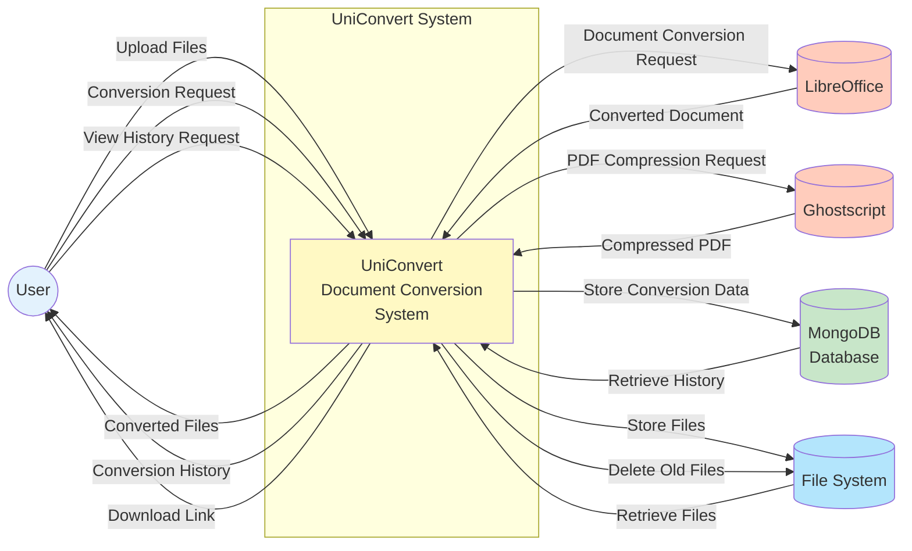

# Data Flow Diagram (Level 0) - UniConvert

## Context Diagram (DFD Level 0)

### External Entities

1. **User**
   - Primary actor who interacts with the system
   - Uploads files for conversion
   - Downloads converted files
   - Views conversion history

2. **LibreOffice**
   - External conversion tool
   - Handles DOCX, PPT, Excel to PDF conversions
   - Handles PDF to DOCX conversions

3. **Ghostscript**
   - External compression tool
   - Handles PDF compression with quality levels

4. **MongoDB Database**
   - Stores conversion history
   - Tracks file metadata and statistics

5. **File System**
   - Temporary storage for uploaded files
   - Storage for converted files
   - Subject to automated cleanup

### Data Flows

#### Input Flows (User → System)
- **Upload Files**: User uploads documents/images for conversion
- **Conversion Request**: User selects conversion type and initiates process
- **View History Request**: User requests to see past conversions

#### Output Flows (System → User)
- **Converted Files**: System provides converted documents
- **Conversion History**: System displays past conversion records
- **Download Link**: System provides links to download files

#### System Flows
- **Document Conversion**: System sends files to LibreOffice for conversion
- **PDF Compression**: System sends PDFs to Ghostscript for compression
- **Data Storage**: System stores conversion metadata in MongoDB
- **File Management**: System stores/retrieves/deletes files from file system

### System Boundary
The UniConvert system acts as the central processing unit that:
- Accepts user requests
- Coordinates with external tools
- Manages data persistence
- Handles file lifecycle
