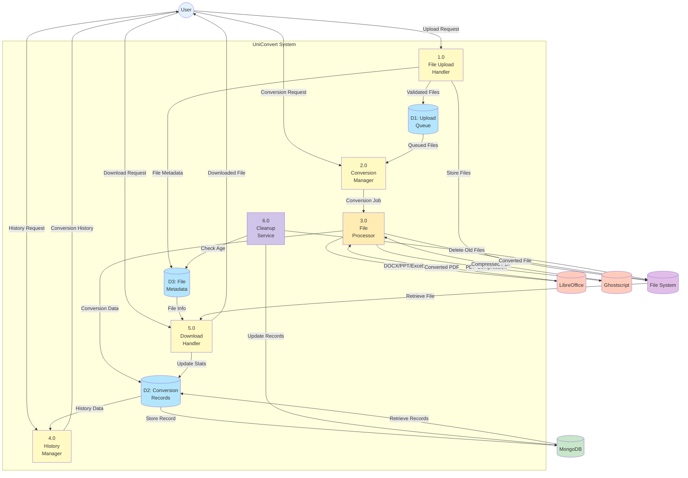

# Data Flow Diagram (Level 1) - UniConvert

## Level 1 DFD - Process Breakdown

### Processes

#### 1.0 File Upload Handler
**Purpose**: Validate and store uploaded files
- **Inputs**: Upload request from User
- **Outputs**: 
  - Validated files to Upload Queue (D1)
  - File metadata to File Metadata store (D3)
  - Physical files to File System
- **Processing**: 
  - Validate file type and size (max 10MB)
  - Generate unique file identifiers
  - Store files temporarily

#### 2.0 Conversion Manager
**Purpose**: Coordinate conversion requests
- **Inputs**: 
  - Conversion request from User
  - Queued files from Upload Queue (D1)
- **Outputs**: Conversion jobs to File Processor (P3)
- **Processing**:
  - Determine conversion type
  - Queue conversion jobs
  - Track conversion status

#### 3.0 File Processor
**Purpose**: Execute file conversions and operations
- **Inputs**: Conversion jobs from Conversion Manager (P2)
- **Outputs**:
  - Conversion requests to LibreOffice/Ghostscript
  - Converted files to File System
  - Conversion data to Conversion Records (D2)
- **Processing**:
  - Execute document conversions via LibreOffice
  - Execute PDF compression via Ghostscript
  - Merge PDFs using pdf-lib
  - Convert images to PDF using pdfkit
  - Store conversion metadata

#### 4.0 History Manager
**Purpose**: Manage conversion history
- **Inputs**: 
  - History request from User
  - Records from Conversion Records (D2)
- **Outputs**: Conversion history to User
- **Processing**:
  - Retrieve conversion records from MongoDB
  - Format history data
  - Calculate statistics

#### 5.0 Download Handler
**Purpose**: Serve converted files to users
- **Inputs**:
  - Download request from User
  - File info from File Metadata (D3)
  - Files from File System
- **Outputs**:
  - Downloaded file to User
  - Updated stats to Conversion Records (D2)
- **Processing**:
  - Validate download request
  - Retrieve file from storage
  - Track download count
  - Serve file to user

#### 6.0 Cleanup Service
**Purpose**: Automated file cleanup (cron job)
- **Inputs**: File metadata from File Metadata store (D3)
- **Outputs**:
  - Delete commands to File System
  - Update records to MongoDB
- **Processing**:
  - Check file age (1 hour threshold)
  - Delete expired files
  - Update database records
  - Run every hour

### Data Stores

#### D1: Upload Queue
- Temporary queue for uploaded files awaiting conversion
- In-memory or Redis-based queue

#### D2: Conversion Records
- Persistent storage of conversion history
- Stored in MongoDB
- Includes: file names, sizes, timestamps, download counts

#### D3: File Metadata
- Metadata about uploaded and converted files
- Includes: file paths, creation time, expiry time
- Used for cleanup operations

### External Entities
- **User**: Interacts with the system
- **LibreOffice**: Document conversion engine
- **Ghostscript**: PDF compression engine
- **MongoDB**: Persistent database
- **File System**: Temporary file storage
