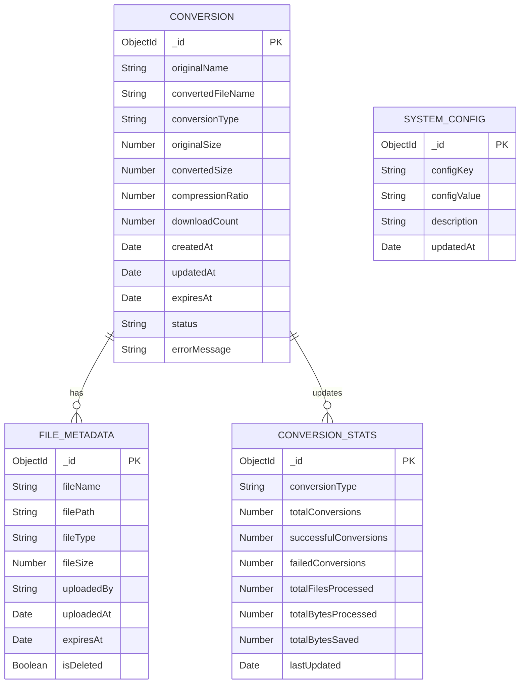

# Database ER Diagram - UniConvert



## Entity Descriptions

### CONVERSION
**Purpose**: Stores information about each file conversion operation

**Attributes**:
- `_id` (ObjectId, PK): Unique identifier for the conversion record
- `originalName` (String): Original filename uploaded by user
- `convertedFileName` (String): Generated filename for converted file
- `conversionType` (String): Type of conversion (e.g., "docx-to-pdf", "merge-pdf")
- `originalSize` (Number): Size of original file in bytes
- `convertedSize` (Number): Size of converted file in bytes
- `compressionRatio` (Number): Compression ratio percentage (if applicable)
- `downloadCount` (Number): Number of times file was downloaded
- `createdAt` (Date): Timestamp when conversion was initiated
- `updatedAt` (Date): Timestamp of last update
- `expiresAt` (Date): Timestamp when file will be auto-deleted (createdAt + 1 hour)
- `status` (String): Conversion status ("pending", "processing", "completed", "failed")
- `errorMessage` (String): Error details if conversion failed

**Indexes**:
- `_id`: Primary key (auto-indexed)
- `createdAt`: For sorting and cleanup queries
- `expiresAt`: For cleanup cron job
- `status`: For filtering active conversions

---

### FILE_METADATA
**Purpose**: Stores metadata about uploaded and converted files

**Attributes**:
- `_id` (ObjectId, PK): Unique identifier for the file metadata
- `fileName` (String): Name of the file
- `filePath` (String): Relative path to file in file system
- `fileType` (String): MIME type or file extension
- `fileSize` (Number): Size of file in bytes
- `uploadedBy` (String): User identifier (IP address or session ID)
- `uploadedAt` (Date): Timestamp when file was uploaded
- `expiresAt` (Date): Timestamp when file should be deleted
- `isDeleted` (Boolean): Flag indicating if file has been deleted

**Indexes**:
- `_id`: Primary key (auto-indexed)
- `expiresAt`: For cleanup operations
- `isDeleted`: For filtering active files

---

### CONVERSION_STATS
**Purpose**: Aggregated statistics for analytics and monitoring

**Attributes**:
- `_id` (ObjectId, PK): Unique identifier for stats record
- `conversionType` (String): Type of conversion being tracked
- `totalConversions` (Number): Total number of conversion attempts
- `successfulConversions` (Number): Number of successful conversions
- `failedConversions` (Number): Number of failed conversions
- `totalFilesProcessed` (Number): Total count of files processed
- `totalBytesProcessed` (Number): Total bytes processed
- `totalBytesSaved` (Number): Total bytes saved through compression
- `lastUpdated` (Date): Last update timestamp

**Indexes**:
- `_id`: Primary key (auto-indexed)
- `conversionType`: For filtering by conversion type
- `lastUpdated`: For recent stats queries

---

### SYSTEM_CONFIG
**Purpose**: Stores system configuration and settings

**Attributes**:
- `_id` (ObjectId, PK): Unique identifier for config entry
- `configKey` (String): Configuration key (e.g., "MAX_FILE_SIZE", "RETENTION_HOURS")
- `configValue` (String): Configuration value
- `description` (String): Human-readable description of the config
- `updatedAt` (Date): Last update timestamp

**Indexes**:
- `_id`: Primary key (auto-indexed)
- `configKey`: Unique index for fast lookups

**Example Records**:
```json
{
  "configKey": "MAX_FILE_SIZE",
  "configValue": "10485760",
  "description": "Maximum file size in bytes (10MB)"
}
{
  "configKey": "FILE_RETENTION_HOURS",
  "configValue": "1",
  "description": "Hours before files are auto-deleted"
}
```

---

## Relationships

### CONVERSION → FILE_METADATA (One-to-Many)
- Each conversion record can reference multiple file metadata records
- Original file metadata and converted file metadata
- Relationship: `CONVERSION.convertedFileName` references `FILE_METADATA.fileName`

### CONVERSION → CONVERSION_STATS (One-to-Many Updates)
- Each conversion updates the corresponding stats record
- Aggregated by conversion type
- Updated via application logic (not foreign key)

---

## Sample Data

### CONVERSION Record
```json
{
  "_id": "65a1b2c3d4e5f6g7h8i9j0k1",
  "originalName": "document.docx",
  "convertedFileName": "document_1707654321.pdf",
  "conversionType": "docx-to-pdf",
  "originalSize": 524288,
  "convertedSize": 245760,
  "compressionRatio": 53.1,
  "downloadCount": 3,
  "createdAt": "2024-02-11T10:30:00Z",
  "updatedAt": "2024-02-11T10:35:00Z",
  "expiresAt": "2024-02-11T11:30:00Z",
  "status": "completed",
  "errorMessage": null
}
```

### FILE_METADATA Record
```json
{
  "_id": "65a1b2c3d4e5f6g7h8i9j0k2",
  "fileName": "document_1707654321.pdf",
  "filePath": "/converted/document_1707654321.pdf",
  "fileType": "application/pdf",
  "fileSize": 245760,
  "uploadedBy": "192.168.1.100",
  "uploadedAt": "2024-02-11T10:30:00Z",
  "expiresAt": "2024-02-11T11:30:00Z",
  "isDeleted": false
}
```
