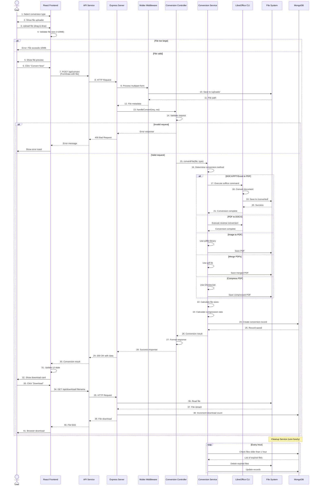

# Sequence Diagram - File Conversion Process

## Sequence Flow Description

### Phase 1: File Selection and Upload (Steps 1-12)
1. User selects the desired conversion type from the UI
2. Frontend displays the file uploader component
3. User uploads a file via drag-and-drop or file browser
4. Frontend validates file size (must be ≤ 10MB)
5. If valid, frontend shows file preview with name and size
6. User clicks "Convert Now" button
7. Frontend sends POST request to `/api/convert` with FormData
8. API service forwards the HTTP request to Express server
9. Server passes request through Multer middleware
10. Multer saves the uploaded file to `/uploads/` directory
11. File system returns the file path
12. Multer returns file metadata to the server

### Phase 2: Validation and Processing (Steps 13-21)
13. Server routes request to Conversion Controller
14. Controller validates the request (file type, conversion type)
15. Controller calls Conversion Service with file and type
16. Service determines the appropriate conversion method
17-21. Based on conversion type:
   - **Document conversion**: Calls LibreOffice CLI
   - **PDF to DOCX**: Uses LibreOffice reverse conversion
   - **Image to PDF**: Uses pdfkit library
   - **Merge PDFs**: Uses pdf-lib library
   - **Compress PDF**: Uses Ghostscript

### Phase 3: Result Processing (Steps 22-32)
22. Service calculates original and converted file sizes
23. Service calculates compression ratio (if applicable)
24. Service creates a conversion record in MongoDB
25. Database confirms record saved
26. Service returns conversion result to controller
27. Controller formats the response data
28. Controller sends success response to server
29. Server returns 200 OK with conversion data
30. API service receives the result
31. Frontend updates UI state with result
32. Frontend displays download card with file information

### Phase 4: File Download (Steps 33-41)
33. User clicks the "Download" button
34. Frontend sends GET request to `/api/download/:filename`
35. API forwards request to server
36. Server reads the file from file system
37. File system returns file stream
38. Server increments download count in database
39. Server streams file to API
40. API receives file blob
41. Browser initiates file download for user

### Background Process: Automated Cleanup
- **Frequency**: Runs every hour via cron job
- **Process**:
  1. Service queries database for files older than 1 hour
  2. Database returns list of expired files
  3. Service deletes files from file system
  4. Service updates database records to mark files as deleted

## Error Handling

### Client-Side Errors
- File size exceeds 10MB → Show error toast
- Invalid file type → Show error toast
- Network error → Show error toast

### Server-Side Errors
- Invalid request → 400 Bad Request
- Conversion failure → 500 Internal Server Error
- File not found → 404 Not Found
- Database error → 500 Internal Server Error

## Performance Considerations
- Async file processing prevents blocking
- Progress updates via frontend state management
- File streaming for large downloads
- Automated cleanup prevents disk space issues
