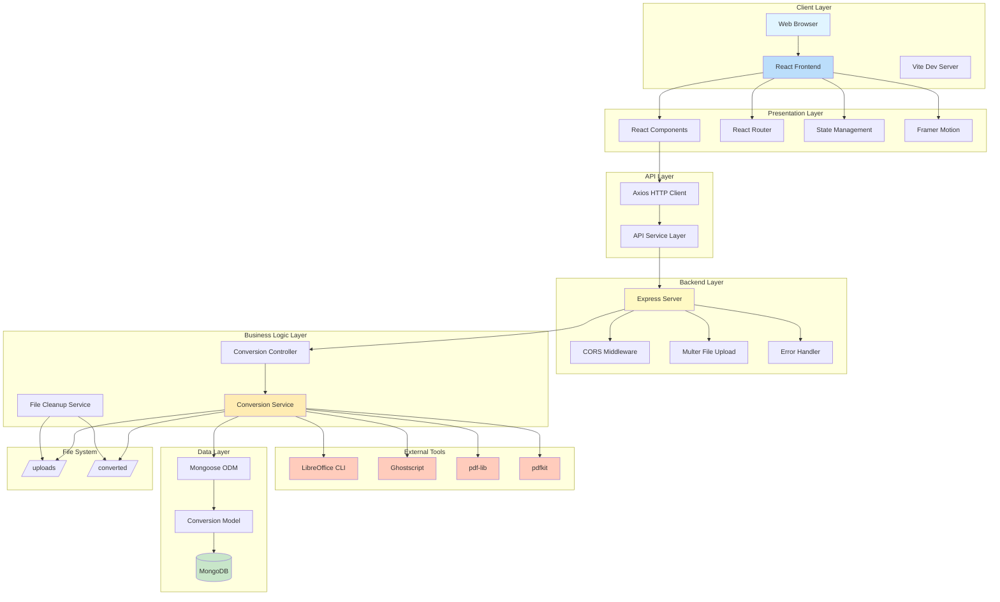

# System Architecture Diagram - UniConvert

## Architecture Overview

### Client Layer
- **Web Browser**: User interface access point
- **React Frontend**: Single-page application built with React 18
- **Vite Dev Server**: Fast development server with HMR

### Presentation Layer
- **React Components**: Modular UI components (Navbar, FileUploader, etc.)
- **React Router**: Client-side routing for navigation
- **State Management**: React hooks for state management
- **Framer Motion**: Smooth animations and transitions

### API Layer
- **Axios HTTP Client**: HTTP request handling
- **API Service Layer**: Abstraction for backend communication

### Backend Layer
- **Express Server**: Node.js web server
- **CORS Middleware**: Cross-origin resource sharing
- **Multer**: Multipart form data and file upload handling
- **Error Handler**: Centralized error handling

### Business Logic Layer
- **Conversion Controller**: Request handling and validation
- **Conversion Service**: Core conversion logic
- **File Cleanup Service**: Automated file deletion (cron job)

### External Tools
- **LibreOffice CLI**: Document conversion (DOCX, PPT, Excel → PDF)
- **Ghostscript**: PDF compression
- **pdf-lib**: PDF merging
- **pdfkit**: Image to PDF conversion

### Data Layer
- **MongoDB**: NoSQL database for conversion history
- **Mongoose ODM**: Object data modeling
- **Conversion Model**: Schema for conversion records

### File System
- **/uploads/**: Temporary storage for uploaded files
- **/converted/**: Storage for converted files
