# Use Case Diagram - UniConvert

```mermaid
graph TB
    User((User))
    Admin((System Admin))
    
    subgraph "UniConvert System"
        UC1[Convert DOCX to PDF]
        UC2[Convert PDF to DOCX]
        UC3[Convert PPT to PDF]
        UC4[Convert Excel to PDF]
        UC5[Convert Image to PDF]
        UC6[Merge Multiple PDFs]
        UC7[Compress PDF]
        UC8[Upload Files]
        UC9[Download Converted Files]
        UC10[View Conversion History]
        UC11[Toggle Dark Mode]
        UC12[View File Statistics]
        UC13[Auto Delete Old Files]
        UC14[Monitor System]
    end

    User --> UC1
    User --> UC2
    User --> UC3
    User --> UC4
    User --> UC5
    User --> UC6
    User --> UC7
    User --> UC8
    User --> UC9
    User --> UC10
    User --> UC11
    User --> UC12
    
    UC1 -.includes.-> UC8
    UC2 -.includes.-> UC8
    UC3 -.includes.-> UC8
    UC4 -.includes.-> UC8
    UC5 -.includes.-> UC8
    UC6 -.includes.-> UC8
    UC7 -.includes.-> UC8
    
    UC1 -.includes.-> UC9
    UC2 -.includes.-> UC9
    UC3 -.includes.-> UC9
    UC4 -.includes.-> UC9
    UC5 -.includes.-> UC9
    UC6 -.includes.-> UC9
    UC7 -.includes.-> UC9
    
    UC13 -.extends.-> UC10
    
    Admin --> UC13
    Admin --> UC14

    style User fill:#e3f2fd
    style Admin fill:#fff3e0
    style UC1 fill:#c8e6c9
    style UC2 fill:#c8e6c9
    style UC3 fill:#c8e6c9
    style UC4 fill:#c8e6c9
    style UC5 fill:#c8e6c9
    style UC6 fill:#ffccbc
    style UC7 fill:#ffccbc
    style UC8 fill:#fff9c4
    style UC9 fill:#fff9c4
    style UC10 fill:#b3e5fc
    style UC11 fill:#f8bbd0
    style UC12 fill:#b3e5fc
    style UC13 fill:#d1c4e9
    style UC14 fill:#d1c4e9
```

## Use Case Descriptions

### Primary Actors
- **User**: End user who needs to convert documents
- **System Admin**: Administrator who monitors and maintains the system

### Use Cases

#### Document Conversion (User)
1. **Convert DOCX to PDF**: Convert Microsoft Word documents to PDF format
2. **Convert PDF to DOCX**: Convert PDF files back to editable Word documents
3. **Convert PPT to PDF**: Convert PowerPoint presentations to PDF
4. **Convert Excel to PDF**: Convert Excel spreadsheets to PDF
5. **Convert Image to PDF**: Convert JPG/PNG images to PDF format

#### PDF Operations (User)
6. **Merge Multiple PDFs**: Combine multiple PDF files into a single document
7. **Compress PDF**: Reduce PDF file size with quality options (low, medium, high)

#### File Management (User)
8. **Upload Files**: Drag-and-drop or browse to upload files (max 10MB)
9. **Download Converted Files**: Download the converted/processed files
10. **View Conversion History**: See past conversions with statistics
11. **Toggle Dark Mode**: Switch between light and dark themes
12. **View File Statistics**: See file sizes, compression ratios, download counts

#### System Management (Admin)
13. **Auto Delete Old Files**: Automated cleanup of files older than 1 hour
14. **Monitor System**: Track system health and conversion metrics

### Relationships
- **Includes**: All conversion use cases include file upload and download
- **Extends**: Auto-delete extends the conversion history functionality
